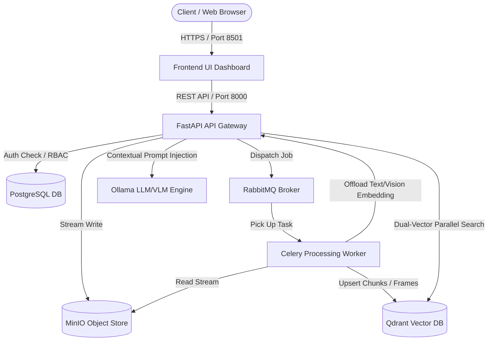

# Enterprise Multimodal Digital Asset Management (DAM) & RAG Platform

> **Portfolio Showcase:** Designed and engineered as a production-grade, distributed systems architecture demonstrating advanced backend orchestration, decoupled microservices, asynchronous task queues, high-performance vector indexing, and multimodal Large Language Model (LLM/VLM) integration.

---

## Executive Overview

The **Enterprise Multimodal DAM & RAG Platform** is a decoupled, containerized digital asset management system designed to process, analyze, and index heterogeneous enterprise assets—including PDFs, high-resolution images, audio streams, and long-form video files. Built to simulate high-throughput enterprise workloads, the platform features a microservice architecture separating ingestion streaming, background task execution, vector storage grids, and local LLM/VLM inference clusters.

The system provides users with real-time progress tracking, conversational Retrieval-Augmented Generation (RAG), timeline-aware summaries, and dual-vector cross-modal semantic search through an interactive web workspace.

---

## Architectural Topology

The following diagram outlines the decoupled lifecycle of an asset from direct browser streaming down to distributed vector indexing, alongside parallel querying pathways:



---

## Key Engineering & Architecture Features

* **Low-RAM Buffered Streaming Ingestion:** Files stream across network chunks directly from the UI interface into S3 object storage without buffering entire multi-megabyte payloads into host memory, preventing out-of-memory (OOM) failures.
* **Asynchronous Lifespan Warmups:** Model caching operations and resource pool connections are initialized at boot via thread pools, ensuring container health probes never fail on container boot.
* **Resilient Non-Blocking Inference Backoffs:** Calls targeting local LLM and VLM services combine asynchronous network drivers (`httpx`) with exponential backoff loops to absorb cold-start delays gracefully.
* **Dual-Vector Cross-Modal Indexing:** Leverages specialized embedding partitions (`text_chunks` at 384 dimensions via `all-MiniLM-L6-v2` and `image_features` at 512 dimensions via `clip-ViT-B-32`) to enable unified semantic cross-examination.
* **Dynamic Low-Context Guardrails:** Metadata depth is evaluated prior to synthesis; assets lacking dense textual content bypass expensive multi-tier LLM workflows to prevent hallucinations.
* **Transactional Resource Hygiene:** Background workers systematically sweep and clean temporary execution directories within `finally` blocks, eliminating disk bloat on parallel nodes.

---

## Technology Stack

| Domain | Technologies & Frameworks |
| --- | --- |
| **API & Gateway Layer** | FastAPI, Uvicorn, Pydantic v2, PyJWT, Bcrypt, Prometheus FastAPIRuntime |
| **Frontend Dashboard** | Streamlit, Requests, Pandas |
| **Asynchronous & Caching** | Celery, RabbitMQ, Redis, Uvicorn Threadpool Executors |
| **Storage & DB** | PostgreSQL 15, SQLAlchemy, MinIO (S3-compatible Object Storage) |
| **Vector Indexing & AI** | Qdrant Vector Engine, Sentence-Transformers (`all-MiniLM-L6-v2`, `clip-ViT-B-32`), Faster-Whisper, OpenCV, PyPDF |
| **Inference Orchestration** | Ollama Engine, Qwen 2.5 (1.5B text model), LLaVA (Vision model) |
| **Testing & Tooling** | Pytest, In-Memory SQLite, Docker & Docker Compose |

---

## Microservice Matrix

The application orchestrates **decoupled containers** communicating over a virtual bridge network (`dam-network`):

| Container Name | Internal Hostname | Port Mapping | Storage Volume / Mount |
| --- | --- | --- | --- |
| `dam-frontend-ui` | `frontend-ui` | `8501:8501` | Ephemeral Runtime |
| `dam-api-gateway` | `api-gateway` | `8000:8000` | `shared_media:/app/shared-media` |
| `dam-ingestion-worker` | `ingestion-service` | Internal Pool | `shared_media:/app/shared-media` |
| `dam-vector-db` | `vector-db` | `6333:6333`, `6334:6334` | `qdrant_storage:/qdrant/storage` |
| `dam-minio` | `minio` | `9000:9000`, `9001:9001` | `minio_data:/data` |
| `dam-ollama-engine` | `ollama-engine` | `11434:11434` | `ollama_storage:/root/.ollama` |
| `dam-postgres-db` | `postgres-db` | `5432:5432` | `postgres_data:/var/lib/postgresql/data` |
| `dam-rabbitmq` | `rabbitmq` | `5672:5672`, `15672:15672` | Ephemeral Runtime |

---

## API Core Routing Ledger

### Authentication Gateway

* **`POST /api/token`**: Authenticates user credentials against PostgreSQL and returns a cryptographically signed JWT bearer token (valid for 120 minutes).
* *Default Accounts Provided:*
* Admin Scope: `admin_vipin` / `admin123`
* Viewer Scope: `viewer_guest` / `guest123`


### Asset Pipeline Ingestion

* **`POST /api/upload`**: Accepts multipart form files, streams straight to MinIO, and dispatches a background ingestion task via RabbitMQ. Returns `202 ACCEPTED` with a unique Celery `task_id`.
* **`GET /api/tasks/{task_id}`**: Interrogates Redis result caches to return live execution state (`PROGRESS`, `SUCCESS`, `FAILURE`) and percentage markers.

### Analytics & Discovery Engines

* **`GET /api/search`**: Executes parallel threadpool vector encodings to query text and visual partitions simultaneously.
* **`GET /api/rag`**: Performs similarity matching across document footprints, builds a grounded context array, and queries the local LLM cluster to generate answers.
* **`GET /api/summarize`**: Chronologically unpacks document frames, text chunks, or passes base64 image streams to LLaVA (VLM) to compile a markdown executive report.

---

## Execution & Deployment Guide

### 1. Clone the Repository

```bash
git clone https://github.com/vipin-mo/multimodal-dam-rag-platform.git
cd multimodal-dam-rag-platform

```

### 2. Launch Container Matrix

Build and spin up the complete container environment in detached mode:

```bash
docker compose up --build -d

```

*(Note: The `ollama-initializer` container automatically pulls down both the `qwen2.5:1.5b` text model and the `llava` vision model upon startup. Therefore, the first boot sequence will take a few minutes to download the weights).*

### 3. Verify Container Health

Confirm all service instances are online:

```bash
docker compose ps

```

### 4. Access Platform Interfaces

* **Streamlit Web Workspace:** Open [http://localhost:8501](http://localhost:8501)
* **FastAPI Interactive OpenAPI Docs:** Open [http://localhost:8000/docs](http://localhost:8000/docs)
* **MinIO Object Storage Console:** Open [http://localhost:9001](http://localhost:9001)

---

## Testing Strategy

The repository contains an isolated testing suite configured to validate RBAC security policies, route integrity, and database operations using an in-memory SQLite fixture model without external cluster dependencies.

Run the test suite via:

```bash
pytest -v

```

---

## License

Distributed under the **MIT License**. See `LICENSE` for more information.